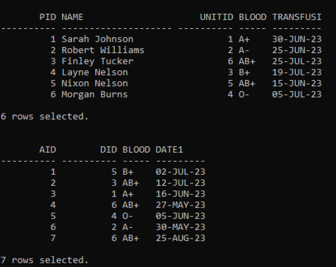
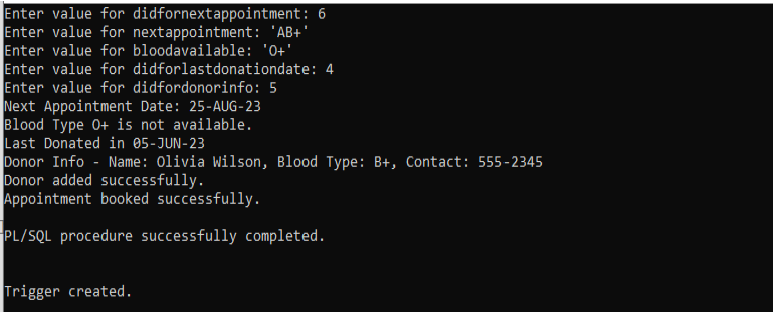
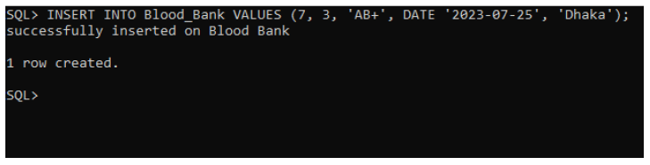

# 🩸 Blood Bank Management System (Distributed DBMS)

A **Distributed Database Management System project** designed to manage blood donors, blood inventory, appointments, and transfusion records efficiently across multiple locations.

---

## 📌 Overview
This system ensures the **safe storage, availability, and distribution of blood** for medical treatments and emergencies while maintaining accurate donor records and inventory control using distributed database concepts.

---

## 🛠️ Technologies & Concepts
- SQL / PL-SQL  
- Distributed Database Systems  
- Fragmentation & Allocation  
- Functions, Procedures & Packages  
- Triggers & Exception Handling  

---

## 📂 Core Tables
- **Donor**
- **Blood_Bank**
- **Transfusion**
- **Appointment**

---

## ⚙️ Key Features
- Donor record management  
- Blood inventory tracking by location  
- Appointment scheduling  
- Blood transfusion records  
- Blood availability checking  

---

## 📸 Screenshots

### Tables

### Functions & Procedures

### Triggers

---

## 📄 License
Developed for academic and educational purposes.
